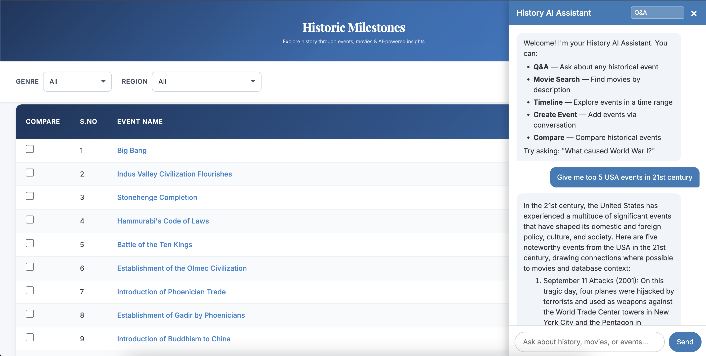
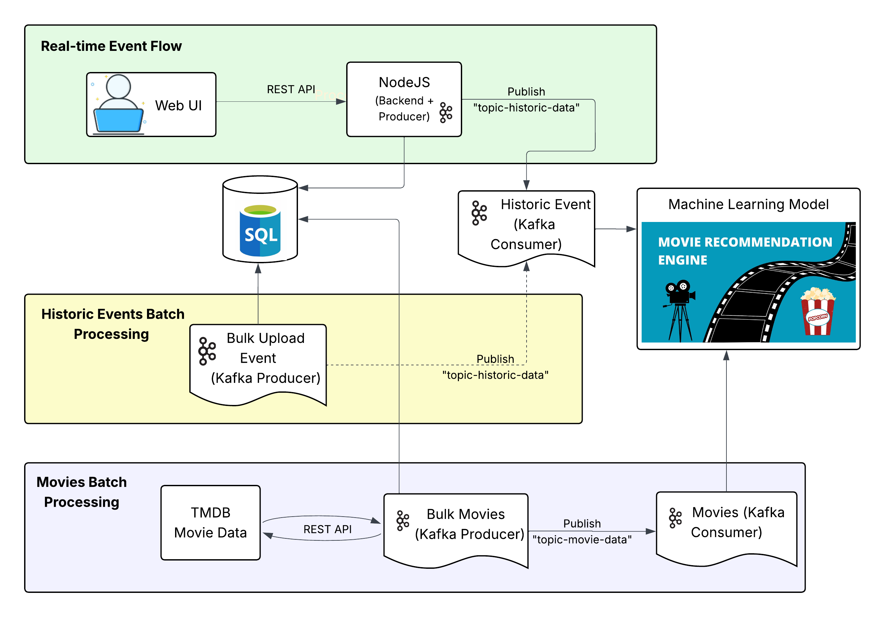

# Historic Movie Recommendation System

A full-stack, event-driven web application that tracks global historical events and provides intelligent movie recommendations using ML-powered content matching. Features a real-time Kafka streaming pipeline, TF-IDF recommendation engine, and an AI chatbot for interactive historical exploration.

## Demo

Watch a short walkthrough of the application: [YouTube Link](https://www.youtube.com/watch?v=3dnpeLyFooQ)

## Architecture

---

## Key Features

### Event-Driven Data Pipeline (ETL)

- **TMDB Movie Ingestion** — `MoviesKafkaProducer.py` fetches movie data (title, overview, poster, release date) from the TMDB API and publishes to Kafka topic `topic-movie-data`. `MoviesKafkaConsumer.py` consumes and inserts into the MySQL `Movies` table.
- **Historical Event Streaming** — When a user adds or updates an event via the web UI, the Node.js backend publishes it to Kafka topic `topic-historic-data`. `HistoricEventsKafkaConsumer.py` picks it up and triggers the recommendation model.

### Apache Kafka Streaming

- Two Kafka topics: `topic-historic-data` (events) and `topic-movie-data` (movies)
- Zookeeper-managed Kafka broker with auto-topic creation
- Node.js KafkaJS producer publishes events in real-time on every CRUD operation
- Python `kafka-python` consumers process streams asynchronously
- Fully containerized with Docker Compose (Zookeeper + Kafka + Node.js)

### ML-Powered Movie Recommendations

- **Algorithm**: TF-IDF Vectorization + Cosine Similarity
- **How it works**:
  1. Combines event fields (name, region, description, year) into a unified text tag
  2. Combines movie fields (title, overview) into a unified text tag
  3. Vectorizes both using `TfidfVectorizer` with bigrams (`ngram_range=(1,2)`), `min_df=2`, `max_df=0.8`, and English stop words
  4. Computes cosine similarity matrix between all events and all movies
  5. Selects top 5 most similar movies per event
  6. Persists recommendations in the `Events_Movies` junction table
- **Triggered automatically** via Kafka whenever an event is created or updated
- Supports both TF-IDF and CountVectorizer-based similarity (configurable)

### AI Chatbot (History AI Assistant)

An integrated slide-out chat panel powered by **Ollama (Mistral LLM)** with real-time SSE streaming. Supports 7 interactive modes:

| # | Mode | Description |
|---|------|-------------|
| 1 | **Q&A** | Ask questions about any historical event — answers grounded in your database context |
| 2 | **Movie Search** | Describe what you want to watch in natural language and get AI-curated suggestions |
| 3 | **Timeline** | Explore events in a time range (e.g. *"What happened in Asia from 1940 to 1980?"*) |
| 4 | **Create Event** | Add historical events through conversation — the AI extracts structured fields automatically |
| 5 | **Compare** | Select 2+ events from the table and get a structured side-by-side comparison with a markdown table |
| 6 | **Why This Movie?** | Click "Why?" on any recommended movie to understand the thematic connection to the event |
| 7 | **Movie Discussion** | Click "Discuss" to deep-dive into a film's historical accuracy, themes, and cinematic merit |

---

## Tech Stack

| Layer | Technology |
|-------|-----------|
| **Frontend** | EJS templates, Bootstrap 3, jQuery, CSS3 (Inter + Playfair Display fonts) |
| **Backend** | Node.js 18, Express.js 4.x |
| **Database** | MySQL 8 (Events, Movies, Event_Genres, Event_References, Events_Movies) |
| **Message Broker** | Apache Kafka with Zookeeper (KafkaJS for Node.js, kafka-python for Python) |
| **ML / NLP** | Python 3, scikit-learn (TF-IDF, Cosine Similarity), pandas, NumPy |
| **AI / LLM** | Ollama (Mistral), Server-Sent Events for streaming |
| **External API** | TMDB (The Movie Database) — movie metadata and poster images |
| **Containerization** | Docker, Docker Compose (3 services: Zookeeper, Kafka, Node.js) |
| **Dev Tools** | Nodemon, dotenv, ESM modules |
