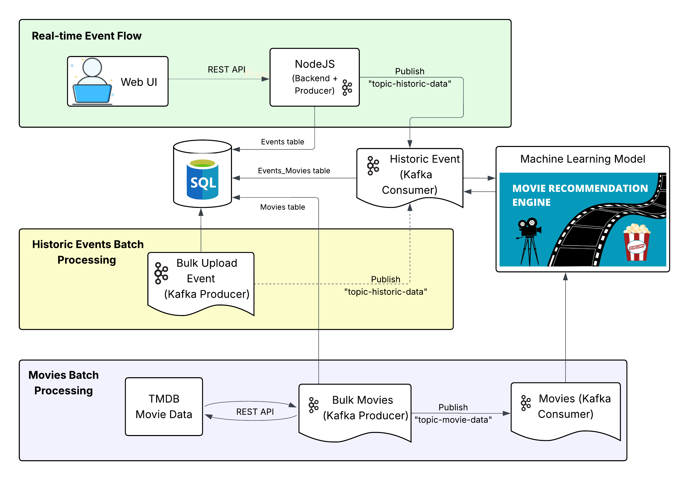

# Historic Movie Recommendation System

A full-stack web application that tracks global historical events and instantly provides movie recommendations that capture each event’s story. You can also pick any movie you love and discover similar films you’ll enjoy.

## 🎬 Demo

Watch a short walkthrough of the application: [Youtube Link](https://youtu.be/Website_Overview)

## 🏗️ Architecture

## 🚀 Features

- **Real-time event ingestion**: Add or update historical events and see recommendations immediately via Kafka streaming.
- **Movie recommendations**:  
  - **Event-driven**: Describe an event and get a curated list of films that match itsthemes.  
  - **Movie-driven**: Pick a movie you like and discover similar titles.
- **Persistent storage**: All events, movies and recommendations are stored in MySQL.
- **Modular microservices**:  
  - Producers push events and movie requests to Kafka topics.  
  - Consumers process streams, enrich data, and call the recommendation model.  
- **Lightweight Node.js web UI**: Browse, search, manage events and view recommendations.

## 🛠️ Tech Stack

| Layer               | Technology                                                      |
| ------------------- | --------------------------------------------------------------- |
| Frontend            | HTML, CSS, EJS templates                                        |
| Backend             | Node.js, Express.js                                             |
| Streaming           | Apache Kafka                                                    |
| Database            | MySQL                                                           |
| NLP & Recommendation| Python (scikit-learn TF–IDF & CountVectorizer, pandas, numpy)   |
| Containerization    | Docker, Docker Compose                                          |